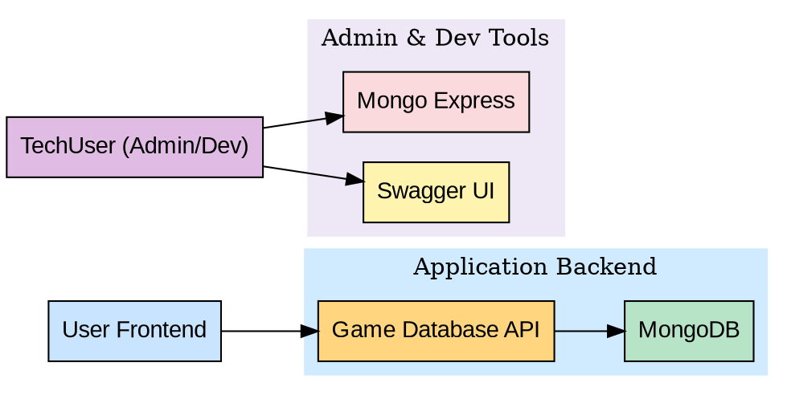
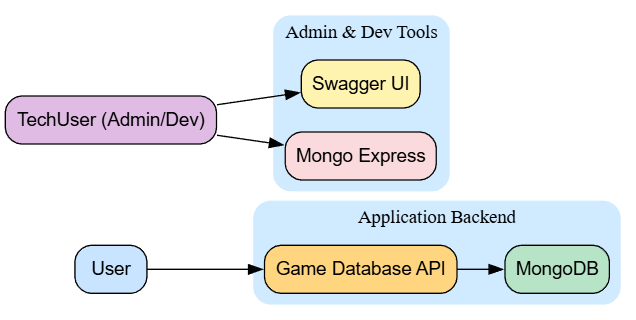
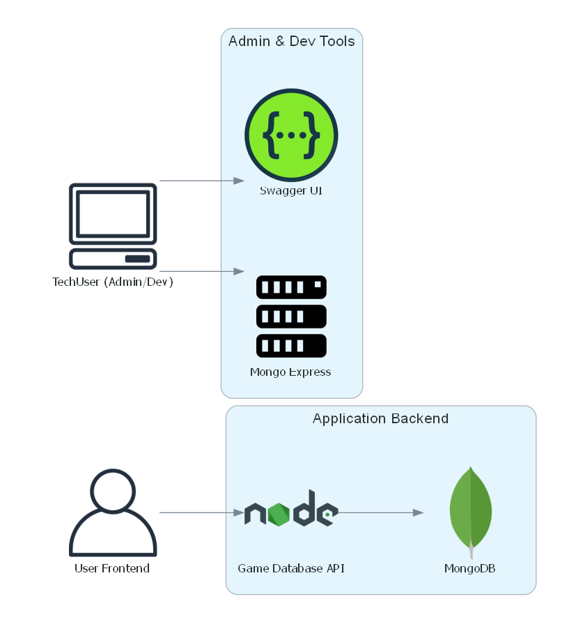

<h1 align="center">📜 Code Chronicler Agent </h1>

**CCAgent** is an AI-powered agent that analyzes source code
repositories to automatically generate **technical documentation** and
**architecture diagrams**. It was designed to help developers, teams,
and reviewers quickly understand complex projects with minimal manual
effort.

> "From source code to knowledge."

&nbsp;&nbsp;&nbsp;

## ✨ Features

-   🔍 Automatic source code analysis
-   📝 Technical documentation generation
-   🗺️ Architecture and flow diagrams generation
-   🤖 Integration with Google ADK agents
-   🔐 Support for private repositories (via GitLab tokens)

&nbsp;&nbsp;&nbsp;

## 🏗️ Project Architecture

    ccagent/
    ├── agent/
    ├── services/
    ├── tools/
    ├── config/
    └── assets/

&nbsp;&nbsp;&nbsp;

## ⚙️ Core Frameworks & Tools

<h3> Agent Development Kit</h3>

The **Google ADK (Agent Development Kit)** is a framework for building and deploying AI agents following software engineering best practices. It supports multiple LLM providers, such as **Gemini**, **GPT**, and **LLaMA**, and provides features for flexible orchestration, deployment, and observability.

In this project, we adopt a **Single-Agent Architecture**, where a single agent is responsible for:

- Receiving user input

- Orchestrating tool execution

- Generating technical documentation

- Creating architecture diagrams

- Producing the final output

All system intelligence and orchestration are centralized in the **CCAgent**, ensuring simplicity, control, and ease of maintenance.

For more information, please visit the official [**Google ADK**](https://google.github.io/adk-docs/) documentation.

&nbsp;&nbsp;&nbsp;

<h3> Gemini (LLM)</h3>

Gemini is the large language model (LLM) used as the **core reasoning engine** of this project. Integrated through custom tools developed specifically for this project, it is responsible for understanding source code, interpreting project structures, generating documentation, and assisting in architectural diagram creation.

In this project, Gemini powers the intelligence behind the **CCAgent**, performing tasks such as:
- Static code analysis
- Automatic README and documentation generation
- Architectural interpretation
- Diagram description and structuring

The integration via ADK ensures optimized performance for agent-based workflows, providing fast, accurate, and context-aware responses tailored for developer productivity.

For more information, please visit the official [**Gemini 2.5 Flash**](https://ai.google.dev/gemini-api/docs/models#gemini-2.5-flash) documentation.

&nbsp;&nbsp;&nbsp;

<h3> Graphviz</h3>

Graphviz is an open-source software that allows the creation and visualization of graphs using the DOT language, enabling the generation of fully customized diagrams with colors, fonts, and layouts.
Diagrams can be exported in **SVG**, **PNG**, or **PDF** formats.

In this project, Graphviz is used to render the diagrams automatically generated by the **Diagrams** library, making it easier to visualize the application architecture.

**DOT Example from a Project:**
>Example of a DOT file generated by the application to describe a real project architecture and rendered with Graphviz.


**DOT Rendering:**

<p align="center">

</p>

For more information, check the official [**Graphviz**](https://www.graphviz.org/) documentation.

&nbsp;&nbsp;&nbsp;

<h3> Diagrams</h3>

Diagrams is a **Diagram as Code** library for Python that allows you to design, prototype, and document system architectures using only code.
It provides native support for multiple **cloud providers**, **frameworks**, **databases**, and **infrastructure components**, enabling full version control of architectural changes over time.

Instead of using traditional design tools, Diagrams makes it possible to define architectures programmatically, ensuring **reproducibility**, **consistency**, and **easy maintenance** as the system evolves.

In this project, **Diagrams is responsible for modeling the architecture**, including:

- Technology logos

- Layer separation

- Entry points and integrations

- Logical grouping of components

The final diagram rendering is performed by **Graphviz**, which converts the generated structure into visual formats such as SVG, PNG, and PDF.

This approach ensures that the documented architecture is a **faithful and up-to-date representation of the implemented system**.

**Example Diagram Generated from Code**
>Diagram representation of a real project generated automatically via Diagrams and rendered with Graphviz.

<p align="center">

</p>

For more information, check the official [**Diagrams**](https://diagrams.mingrammer.com/) documentation.

&nbsp;&nbsp;&nbsp;

## 📦 Source Code Providers

### ✅ Currently Supported
- **GitLab** – Public and private repositories (via access token)

### 🚧 Planned Support
- **GitHub** – Public and private repositories (upcoming)

These platforms are used strictly as **data sources for code retrieval**.  

&nbsp;&nbsp;&nbsp;

## 🚀 Technology Stack

&nbsp;&nbsp;&nbsp;

<table border="0" align="center">
  <tr>
    <td align="center" width="100">
      <a href="https://www.python.org/" target="_blank">
        
        <br>Python
      </a>
    </td>
    <td align="center" width="100">
      <a href="https://google.github.io/adk-docs/" target="_blank">
        
        <br>ADK
      </a>
    </td>
    <td align="center" width="100">
      <a href="https://ai.google.dev/gemini-api/docs?hl=pt-br" target="_blank">
        
        <br>Gemini
      </a>
    </td>
    <td align="center" width="100">
      <a href="https://python-poetry.org/docs/" target="_blank">
        
        <br>Poetry
      </a>
    </td>
    <td align="center" width="100">
      <a href="https://diagrams.mingrammer.com/" target="_blank">
        
        <br>Diagrams
      </a>
    </td>
    <td align="center" width="100">
      <a href="https://graphviz.org/" target="_blank">
        
        <br>Graphviz
      </a>
    </td>
  </tr>
</table>

&nbsp;&nbsp;&nbsp;


## 📋 Prerequisites
> [!WARNING]
> To run the project, you need the following tools and services:

### Local tools
-   Python = 3.12
-   Poetry
-   Graphviz

### External services / LLM
-   Access to Gemini 2.5 Flash (Google LLM)

&nbsp;&nbsp;&nbsp;

## 🚀 Getting Started

### Clone the repository

``` bash
git clone https://github.com/MichaelDouglasPIX/cc-agent.git
cd ccagent
```

### Install dependencies

``` bash
poetry install
```

### Configure environment variables
> [!IMPORTANT]
> Rename the `.env_example` to  `.env` and update the fields.


``` env
GITLAB_TOKEN=your_gitlab_token_here
GOOGLE_GENAI_USE_VERTEXAI=true_or_your_vertexai_value
GOOGLE_API_KEY=your_google_api_key_here
```

### Run the project

``` bash
poetry run adk web --port 8000
```

&nbsp;&nbsp;&nbsp;

## 📄 License

MIT License

------------------------------------------------------------------------


